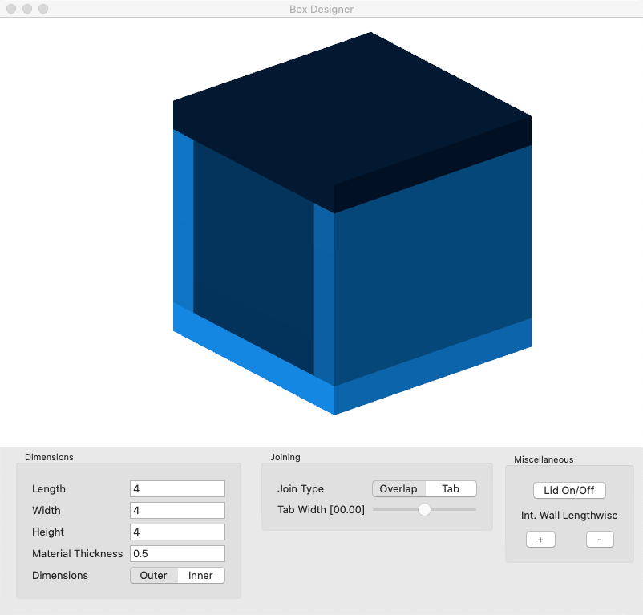

# Box-Designer
This is a box designer that is designed to be used with a glow forge laser cutter.

### Usage

The designer has 3 key tool sections: Demensions, Joining, and Miscellaneous. The demensions has 4 inputs and 1 option. You can change the length, width, hight, and material thickness. Additionally, there is the option to change if these demmensions refer to the outside or inside of the box. The sides of the boxes can be joined differently. Either though tabs or simply overlapping. The tab width can also be adjusted. In the Miscellanious section there are options to take the lid on and off as well as add or remove internal deviders.
### Settings
Units can be changed though Formate > Units.
Color Blind color options are also available under Formate > Color Change.
Low Vision windows with larger text to adjust the settings are available under View > Low Vision.
Additionally, CTRL + D will open the demensions window, CTRL + J will open the Joining window, and CTRL + M will open the Miscellaneous window.
### Box-Designer Minimum System Requirments

* OS: macOS Catalina 10.15.6
* Processor: Intel Core i3 560 @ 3.3 GHz or AMD Phenom II X4 945 @ 3.0 GHz
* Memory: 50 mb of RAM
* Graphics: Intel HD Graphics 5300 1536 MB
* Network: None
* Storage: 1MB Available Space
* Sound Card: None

### Box-Designer Reccomended System Requirments

* OS: macOS Catalina 10.15.6
* Processor: Intel Core i3 560 @ 3.3 GHz or AMD Phenom II X4 945 @ 3.0 GHz
* Memory: 100 mb of RAM
* Graphics: Intel HD Graphics 5300 1536 MB
* Network: None
* Storage: 2MB Available Space
* Sound Card: None

